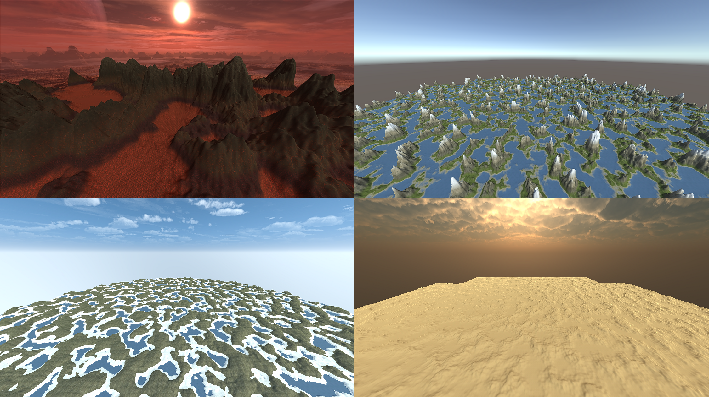
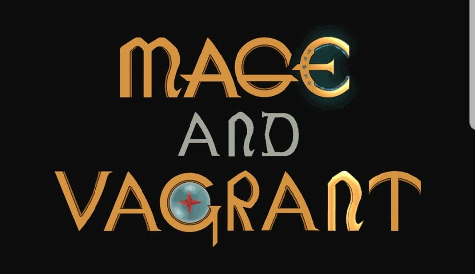

***

### [Tool] Procedural generation of terrain + testing
#### Tool uses noise algorithms Diamond-square & Pelin noise in addition to a "traversability algorithm"
##### [Github reference](https://github.com/slypez/Procedural_generation_of_terrain)

***

### [PC-game] re:Surge
#### Multiplayer game created in course Spelprojekt 2
##### [SGA reference](https://www.gameawards.se/Games/2019/re%3ASurge)

***

### [PC-game] Mage & Vagrant
#### Co-op game created in course Spelprojekt 1
##### [Conceptual trailer](https://www.youtube.com/watch?v=luHtlafBigA)

***

## ...
