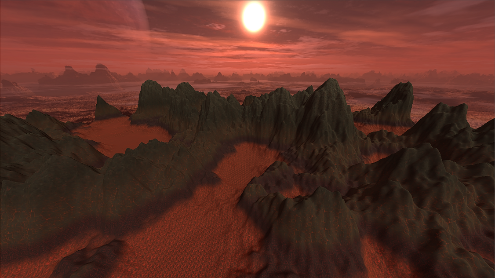
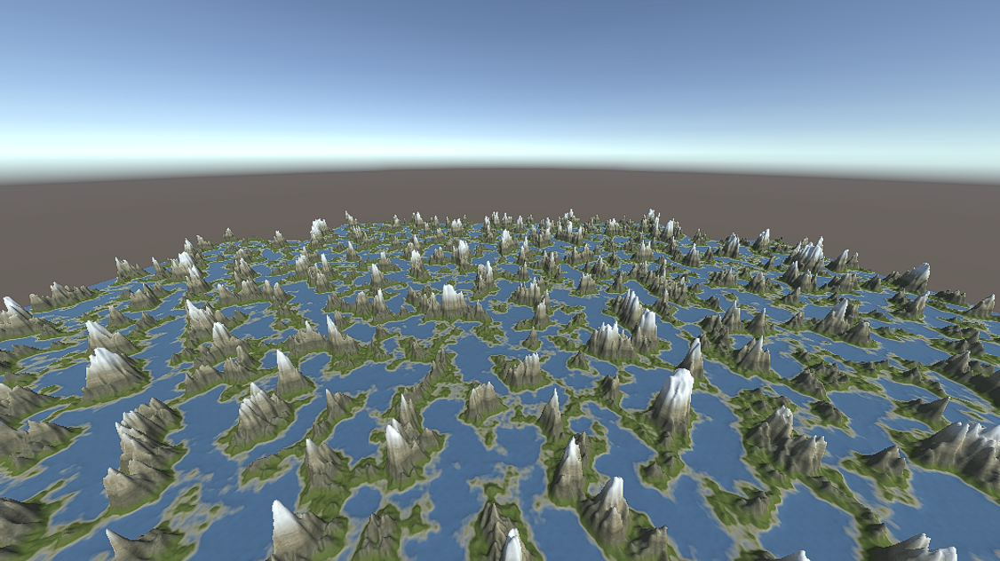
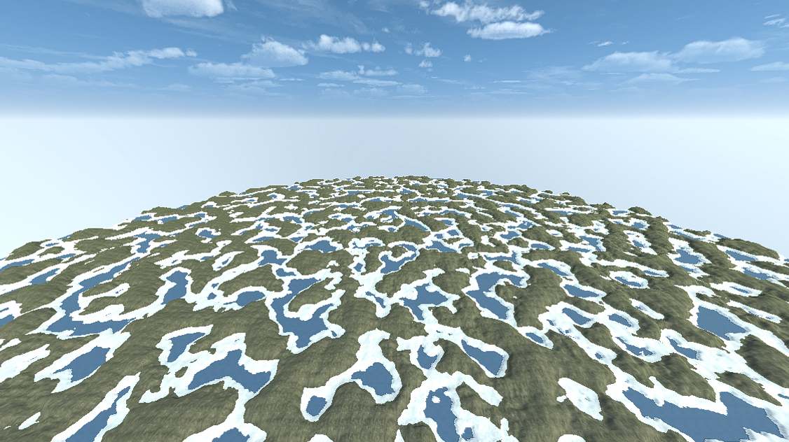
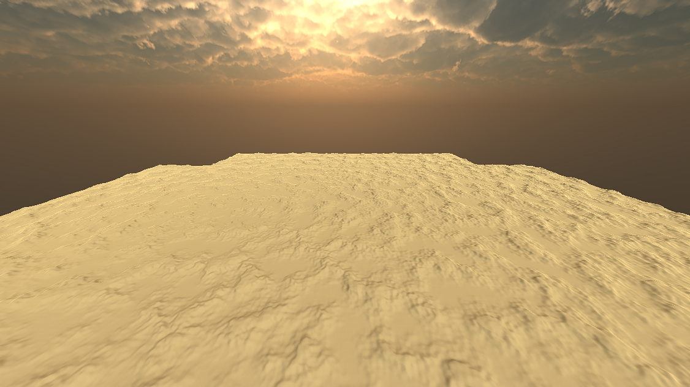
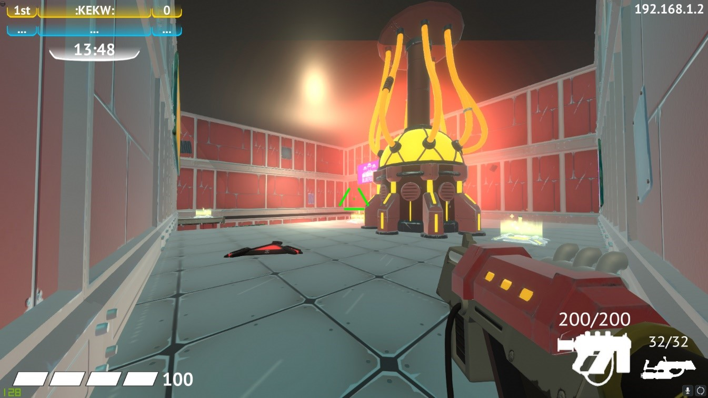

## Tool for procedural generation of terrain
### in adition to traversability check

### [Github reference](https://github.com/slypez/Procedural_generation_of_terrain)

***

 | 

 | 

***

## Multiplayer pc game created from course (Spelprojekt 2)

[SGA reference](https://www.gameawards.se/Games/2019/re%3ASurge)

***

## ...
