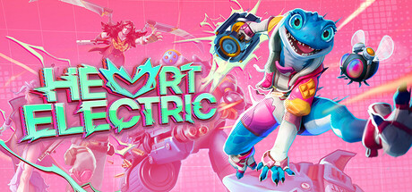
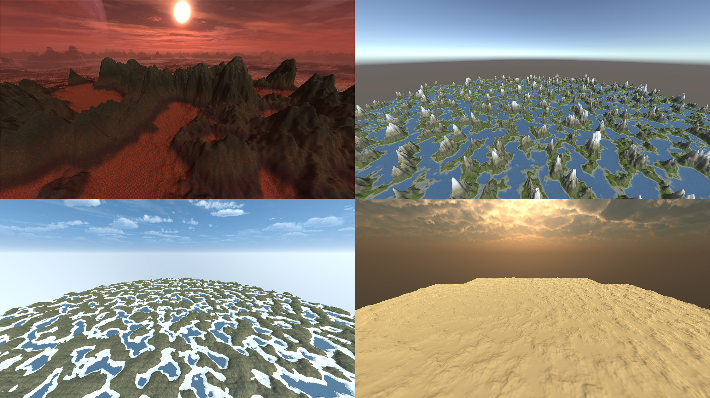
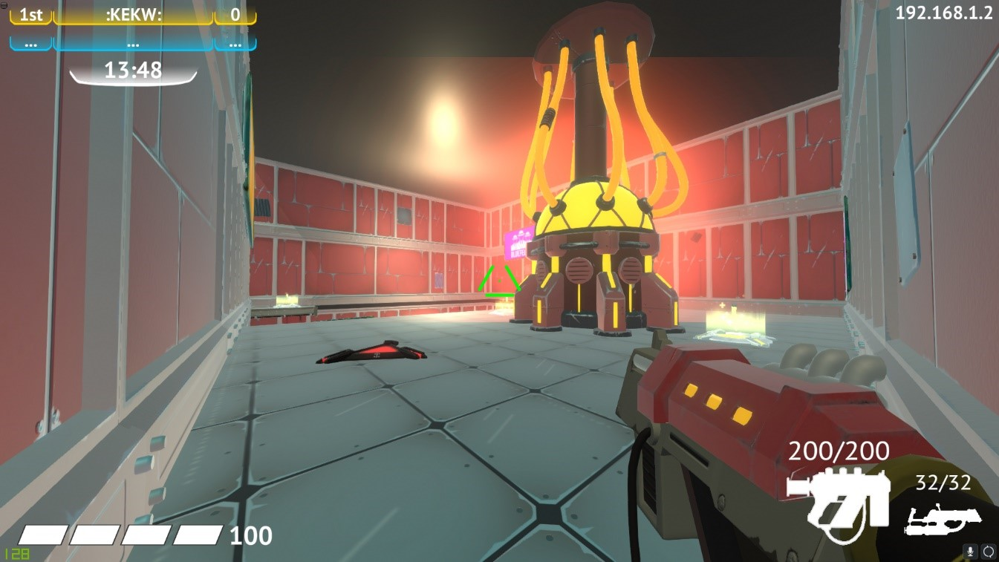
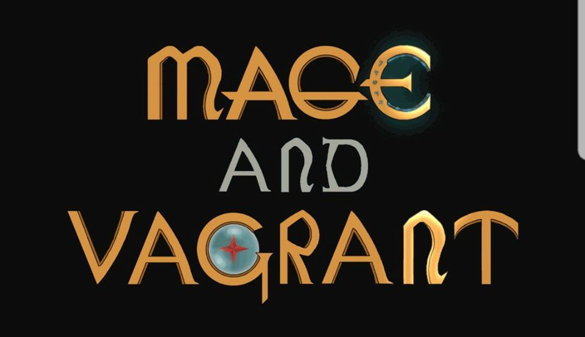
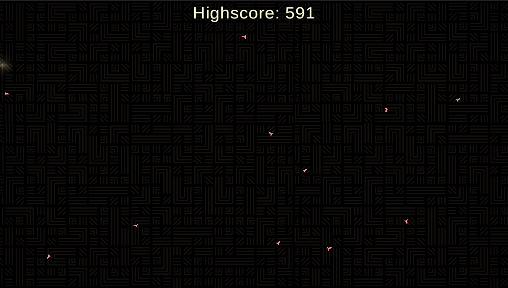
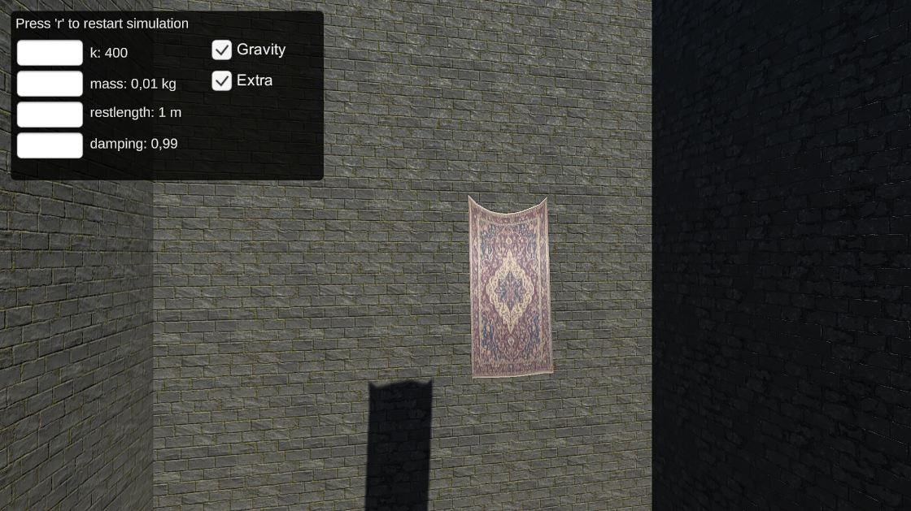

# Professional projects
### [PC-Game] Heart Electric
#### Heart Electric is a fast-paced, tactical, team shooter where four teams try to outsmart and outplay each other in a battle for life sustaining Energy. Invite your friends and come up with your own winning strategies, using unique hero abilities, customizable weapons loadouts and the magnetic “Flux" power that allow you to navigate the environment like never before. Heart Electric invites you to feel the pulse and beat the odds.
##### [Game page](https://modoyo.com/heartelectric)

***

# Academic projects
### [Tool] Procedural generation of terrain + testing
#### Tool uses noise algorithms Diamond-square & Pelin noise in addition to a "traversability algorithm"
##### [Github reference](https://github.com/slypez/Procedural_generation_of_terrain)

***

### [PC-game] re:Surge
#### Multiplayer game created in course "Spelprojekt 2"
##### [SGA reference](https://www.gameawards.se/Games/2019/re%3ASurge)

***

### [PC-game] Mage & Vagrant
#### Co-op game created in course "Spelprojekt 1"
##### [Conceptual trailer](https://www.youtube.com/watch?v=luHtlafBigA)

***

### [PC-game] AvoidTheArrows
#### Game created in course "Game AI"
##### [Build](./AvoidTheArrows/index.html)

***

### [Simulation] Physics-based cloth simulation
#### Simulation created in course "Game physics"
##### [Build](./ClothSimulation/index.html)

***